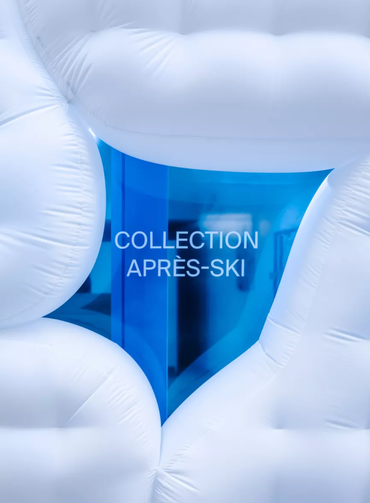

# Heading 1
## Heading 2
### Heading 3
#### Heading 4
##### Heading 5
###### Heading 6

*This test is italick*
_This text is also italic_

This is just regular text.

**This is bolded text.**

***This is bold and Italic text.***

Unordered List:
- Item 1
- Item 2
    -Item 2a
    -Item 2b

Ordered List: 
1. First Item
2. Second Item

This is a link:
[Google's Website](http;//www.google.com)

This is a image:

